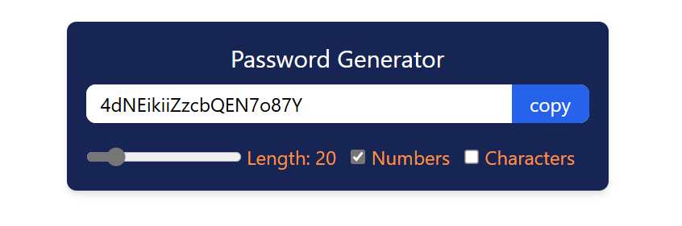
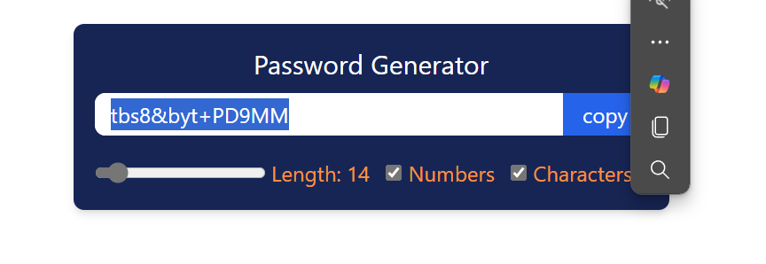

# React Password Generator

A clean, responsive, and customizable password generator built with **React**. Users can generate strong passwords with desired length, numbers, and special characters — and copy them to clipboard instantly.





## Features

- Adjustable password length (6–100 characters)
- Include/exclude numbers
- Include/exclude special characters
- One-click **copy to clipboard**
- Instant generation on input change
- Responsive and minimal UI with Tailwind CSS


## Tech Stack

- [React](https://reactjs.org/)
- [Tailwind CSS](https://tailwindcss.com/)
- JavaScript (ES6+)

---

## Getting Started

### 1. Clone the repository
```bash
git clone https://github.com/your-username/react-password-generator.git
cd react-password-generator
